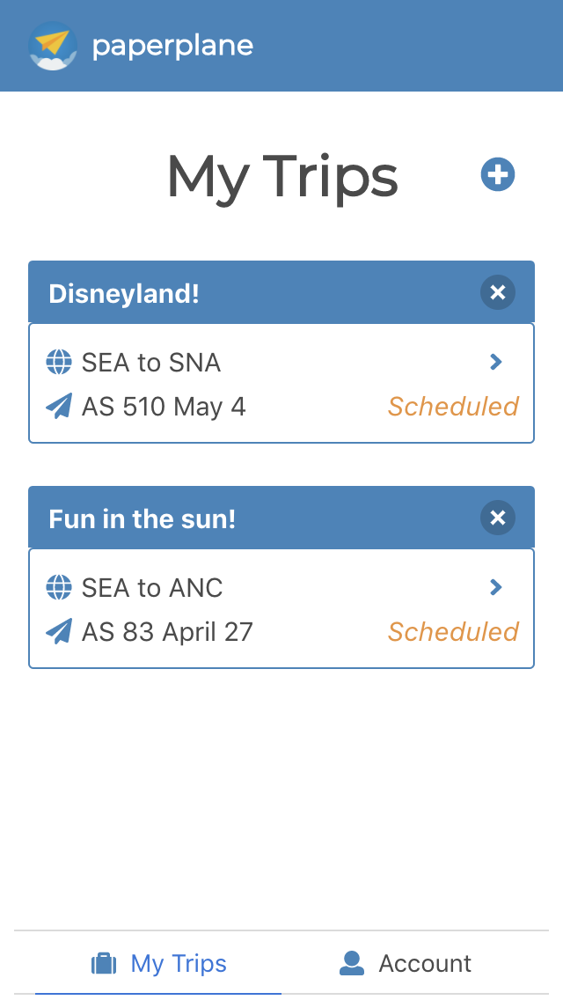

# Paperplane

Paperplane is a mobile-first web app that allows users to track and receive notifications for upcoming flights. Users can create an account, add custom trips, and assign flights to individual trips. Users can also share flight details with friends or family via mobile SMS.

### Live URL: http://placeholder.com
#### Frontend GitHub: https://github.com/aahn84/paperplane-frontend
#### Backend GitHub: https://github.com/aahn84/paperplane-backend

## Features
- Managed state through React Redux store
- Leverage external resources
- Send and retrieve authenticated data from server using REST API

## Core Technologies
- React.js
- React Redux
- React Router
- AJAX/axios
- PostgreSQL
- Authentication
- Knex.js
- Node.js
- Express.js
- REST API
- JavaScript

#### External Resources
- Aviation-Edge API
- Twilio

## Screenshots

### Login/Signup:

<!--  -->
<!--  -->
     

### My Trips:

<!--  -->
<!--  -->
     

### Flights:

<!--  -->
<!--  -->
    

### Flight Details:

<!--  -->

### My Account:

<!--  -->

## Setup
1. Fork and clone this repository
2. Run `npm install`
