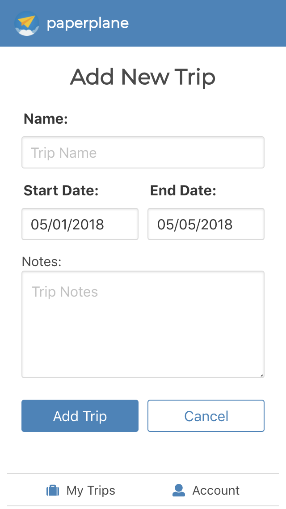

# Paperplane

###### **NOTE: As of June 2, 2018, access to the Aviation-Edge API will be discontinued. Please refer to the demo video linked below.**

Paperplane is a mobile-first web app that allows users to track and receive SMS notifications for upcoming flights. Users can create an account, add custom trips, and assign flights to individual trips.

Planned and built within two weeks by Angela Ahn.

### Live URL: https://paperplane.surge.sh/
#### Frontend GitHub: https://github.com/aahn84/paperplane-frontend
#### Backend GitHub: https://github.com/aahn84/paperplane-backend

### YouTube Demo: https://youtu.be/7qhBXYv4Ebs

## Features
- State management through React Redux store
- Leverage external resources
- Send and retrieve authenticated data from server using REST API

## Core Technologies
- React.js
- React Redux
- React Router
- AJAX/Axios
- PostgreSQL
- Node.js
- Express.js
- Knex.js
- JavaScript
- Heroku Scheduler
- Authentication
- REST API

#### External Resources
- Aviation-Edge API
- Twilio

## Screenshots

### Login/Signup/My Account:

<!--  -->
<!--  -->
<!--  -->
           

### My Trips:

<!--  -->
<!--  -->
     

### Flights:

<!--  -->
<!--  -->
    

### Flight Details:

<!--  -->

## Installation
1. Fork and clone this repository
2. Run `npm install`
